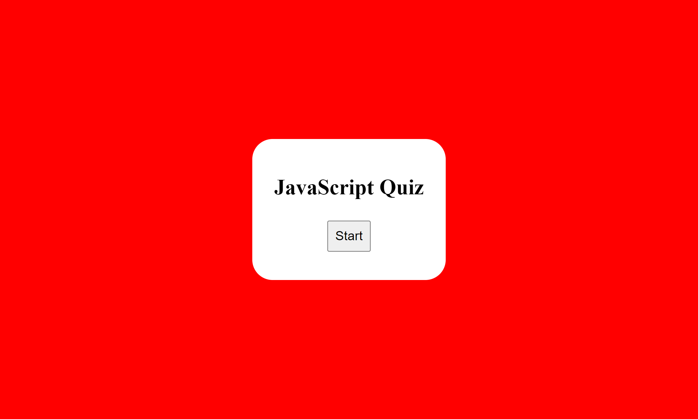

# JavaScript-Easy-Quiz

## Description

This is a simple quiz application built with JavaScript that allows users to test their knowledge of JavaScript concepts. The quiz includes multiple-choice questions, and for each wrong answer, a certain amount of time is deducted from the total time allocated for the quiz. The questions cover various topics related to JavaScript.

https://mattlombard.github.io/JavaScript-Easy-Quiz/

## Usage

To use this quiz, open the index.html file in your web browser of choice. The quiz will not start automatically, so click the "Start Quiz" button to begin. The quiz will display the first question along with a countdown timer. To answer a question, click on one of the provided answer options. If your answer is incorrect, 10 seconds will be deducted from the remaining time. The quiz will move on to the next question automatically.

Once you have answered all six questions, the quiz will display your score along with a form where you can input your initials. Enter your initials and click "Submit" to save your score to the high scores list.

## Credits

Collaborated with: Chris Snyder, Sarah Miller, and Tyrrance Miller
